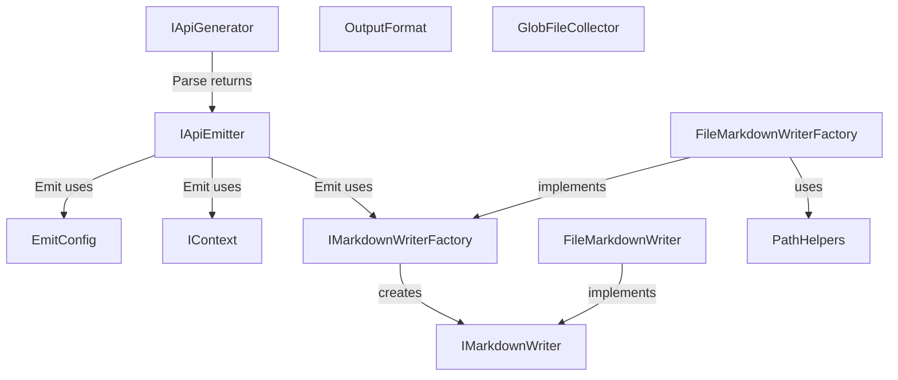

# ApiMarkCore

<!-- All sections below are MANDATORY. If a section does not apply, write
     "N/A - {justification}" rather than removing it. -->

## Architecture

ApiMarkCore is a shared-contracts system. It defines the interfaces, output
conventions, and internal path-safety helpers that all other systems depend on.
There is no system-level executable logic — the system exists to give callers a
single, stable definition of the two-stage generation pipeline interfaces, the
markdown-writing interfaces, and the trusted path-combination helper used by
file-based implementations.

ApiMarkDotNet, ApiMarkCpp, and ApiMarkVhdl each implement IApiGenerator. The `Parse`
method returns an `IApiEmitter` (a private nested class) that holds the parsed symbol
model. The caller then calls `IApiEmitter.Emit` with an `EmitConfig` and
`IMarkdownWriterFactory` to write the documentation tree. ApiMarkTool directly
consumes IApiGenerator; ApiMarkMsbuild spawns ApiMarkTool as a child process
and never calls IApiGenerator in-process. PathHelpers remains an internal
utility used by ApiMarkCore implementations rather than a public dependency
surface. GlobFileCollector is a public static utility consumed by ApiMarkCpp
and ApiMarkVhdl to discover source files using glob patterns.

## External Interfaces

**IApiGenerator (provided)**: First stage of the two-stage pipeline — parses
symbol data for a configured software component.

- *Type*: In-process .NET public API.
- *Role*: Provider — ApiMarkCore publishes this interface; ApiMarkDotNet,
  ApiMarkCpp, and ApiMarkVhdl implement it; ApiMarkTool consumes it directly. ApiMarkMsbuild
  spawns ApiMarkTool as a child process and does not call this interface
  in-process.
- *Contract*: `IApiEmitter Parse(IContext context)` — parses the configured
  software component and returns an `IApiEmitter` ready to emit. No output
  files are written by `Parse`.
- *Constraints*: The implementing class creates no I/O during Parse; callers
  supply a valid, configured context.

**IApiEmitter (provided)**: Second stage of the two-stage pipeline — writes
the complete Markdown documentation tree.

- *Type*: In-process .NET public API.
- *Role*: Provider — ApiMarkCore publishes this interface; language emitter
  nested classes implement it; ApiMarkTool consumes it by calling `Emit` on
  the value returned from `IApiGenerator.Parse`.
- *Contract*: `void Emit(IMarkdownWriterFactory factory, EmitConfig config,
  IContext context)` — writes the complete Markdown tree for a parsed component
  using the supplied factory and configuration. For
  `OutputFormat.GradualDisclosure`, the output MUST include a file named
  `api.md` as the fixed entrypoint plus separate namespace, type, and member
  pages. For `OutputFormat.SingleFile`, a single `api.md` file contains all
  content at the heading levels specified by `EmitConfig.HeadingDepth`.
- *Constraints*: `factory` must not be null; `config` and `context` must not
  be null.

**EmitConfig (provided)**: Immutable value object carrying output-format
configuration for the emit stage.

- *Type*: In-process .NET public API (sealed class, init-only properties).
- *Role*: Provider — ApiMarkCore publishes this type; ApiMarkTool constructs
  it from CLI options; language emitters read it inside `IApiEmitter.Emit`.
- *Contract*: `Format` (`OutputFormat`) — selects between
  `GradualDisclosure` (default) and `SingleFile`; `HeadingDepth` (`int`,
  default 1) — absolute heading level for the top-level section in single-file
  output.

**IContext (provided)**: Minimal output channel for informational and error messages.

- *Type*: In-process .NET public API.
- *Role*: Provider — ApiMarkCore publishes this interface; ApiMarkTool's `Cli.Context`
  implements it; language generators consume it via the `Parse` and `Emit`
  method parameters.
- *Contract*: `void WriteLine(string message)` — writes an informational message;
  `void WriteError(string message)` — writes an error or warning message.
- *Constraints*: Both methods accept non-null message strings; the implementing
  class owns all routing decisions (console, log file, in-memory capture, etc.).

**IMarkdownWriterFactory (provided)**: Factory interface for creating per-file Markdown writers.

- *Type*: In-process .NET public API.
- *Role*: Provider — ApiMarkCore publishes this interface; callers inject it into
  `IApiEmitter.Emit`; language emitters call it to open individual output files.
- *Contract*: `IMarkdownWriter CreateMarkdown(string subFolder, string name)` —
  creates and returns a writer for the file at `subFolder/name.md`. Pass an empty
  string for subFolder to create a root-level file.
- *Constraints*: The caller is responsible for disposing each returned IMarkdownWriter.
  The factory creates output directories as needed.

**IMarkdownWriter (provided)**: Per-file Markdown writing interface.

- *Type*: In-process .NET public API (IDisposable).
- *Role*: Provider — ApiMarkCore publishes this interface; language generators call
  its write methods to append structured content; implementations flush and close
  the underlying file on Dispose.
- *Contract*: WriteHeading, WriteSignature, WriteParagraph, WriteTable,
  WriteCodeBlock, WriteLink methods — see IMarkdownWriter Unit Design for full
  signatures.
- *Constraints*: Each method appends content to the current output file in call
  order; callers invoke methods in document order and dispose the writer when done.

### Internal Utilities

**PathHelpers (internal only)**: Internal static helper for safely combining caller-
supplied relative path segments with a trusted base path.

- *Type*: In-process .NET internal utility.
- *Role*: Internal-only helper used by file-based implementations to validate path
  segments before creating directories or files.
- *Contract*: `string SafePathCombine(string basePath, params string[] relativePaths)`
  returns the combined path when all segments are valid.
- *Constraints*: Rejects combinations that resolve outside the base directory, and rejects
  null arguments.

**GlobFileCollector (public utility)**: Stateless public static utility for discovering
files on the filesystem using gitignore-style glob patterns.

- *Type*: In-process .NET public API.
- *Role*: Shared utility — ApiMarkCpp and ApiMarkVhdl call it to convert caller-supplied
  `--api-headers` and `--source` patterns into a sorted, deduplicated list of absolute
  file paths.
- *Contract*: `IReadOnlyList<string> Collect(IEnumerable<string> patterns,
  IEnumerable<string> languageExtensions, string workingDirectory)` — evaluates inclusion
  and exclusion patterns against the filesystem and returns matching absolute paths.
- *Constraints*: Non-existent roots are silently skipped; `!`-prefixed patterns remove
  matching files; bare `*` final segments trigger language-extension filtering.

## Dependencies

ApiMarkCore depends on `Microsoft.Extensions.FileSystemGlobbing` (OTS) via
`GlobFileCollector`. See `docs/design/ots/file-system-globbing.md` for the
integration and usage design of this OTS item.

## Risk Control Measures

N/A - not a safety-classified software item.

## Data Flow

ApiMarkCore does not process data at runtime. Its contribution to the overall data
flow is:

1. Language generators parse symbol data by reading assembly or header files during
   `IApiGenerator.Parse`. CppGenerator and VhdlGenerator use GlobFileCollector to
   discover which source files to parse based on caller-supplied glob patterns.
2. Language emitters write Markdown content by calling IMarkdownWriter methods in
   document order inside `IApiEmitter.Emit`.
3. ApiMarkTool invokes `IApiGenerator.Parse` then `IApiEmitter.Emit` to trigger the
   full two-stage pipeline for a configured component. ApiMarkMsbuild triggers
   generation by spawning ApiMarkTool as a child process.

## Design Constraints

- Platform: targets a supported .NET LTS release as a class library; no platform-specific code.
- No in-memory document model: Core defines only interfaces and their file-system
  implementations; language-specific generators own all in-memory state.
- Stable API surface: changes to IApiGenerator, IApiEmitter, EmitConfig,
  IMarkdownWriterFactory, or IMarkdownWriter method signatures require corresponding
  updates in all implementing systems.
