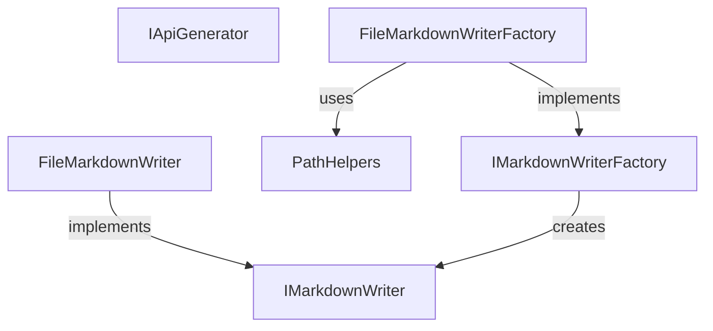

# ApiMarkCore

<!-- All sections below are MANDATORY. If a section does not apply, write
     "N/A - {justification}" rather than removing it. -->

## Architecture

ApiMarkCore is a shared-contracts system. It defines the interfaces, output
conventions, and internal path-safety helpers that all other systems depend on.
There is no system-level executable logic — the system exists to give callers a
single, stable definition of the generation interface, the markdown-writing
interfaces, and the trusted path-combination helper used by file-based
implementations.

ApiMarkDotNet implements IApiGenerator and calls IMarkdownWriterFactory to create
per-file IMarkdownWriter instances. ApiMarkTool directly consumes IApiGenerator;
ApiMarkMsbuild spawns ApiMarkTool as a child process and never calls IApiGenerator
in-process. PathHelpers remains an internal utility used by ApiMarkCore
implementations rather than a public dependency surface.

## External Interfaces

**IApiGenerator (provided)**: Public interface contract for any language generator.

- *Type*: In-process .NET public API.
- *Role*: Provider — ApiMarkCore publishes this interface; ApiMarkDotNet implements
  it; ApiMarkTool consumes it directly. ApiMarkMsbuild spawns ApiMarkTool as a child
  process and does not call this interface in-process.
- *Contract*: `void Generate(IMarkdownWriterFactory factory)` — writes the complete
  Markdown tree for a configured software component using the supplied factory. The
  output MUST include a file named `api.md` as the fixed entrypoint.
- *Constraints*: The implementing class creates output directories as needed;
  callers supply a valid, configured factory.

**IMarkdownWriterFactory (provided)**: Factory interface for creating per-file Markdown writers.

- *Type*: In-process .NET public API.
- *Role*: Provider — ApiMarkCore publishes this interface; callers inject it into
  Generate; language generators call it to open individual output files.
- *Contract*: `IMarkdownWriter CreateMarkdown(string subFolder, string name)` —
  creates and returns a writer for the file at `subFolder/name.md`. Pass an empty
  string for subFolder to create a root-level file.
- *Constraints*: The caller is responsible for disposing each returned IMarkdownWriter.
  The factory creates output directories as needed.

**IMarkdownWriter (provided)**: Per-file Markdown writing interface.

- *Type*: In-process .NET public API (IDisposable).
- *Role*: Provider — ApiMarkCore publishes this interface; language generators call
  its write methods to append structured content; implementations flush and close
  the underlying file on Dispose.
- *Contract*: WriteHeading, WriteSignature, WriteParagraph, WriteTable,
  WriteCodeBlock, WriteLink methods — see IMarkdownWriter Unit Design for full
  signatures.
- *Constraints*: Each method appends content to the current output file in call
  order; callers invoke methods in document order and dispose the writer when done.

### Internal Utilities

**PathHelpers (internal only)**: Internal static helper for safely combining caller-
supplied relative path segments with a trusted base path.

- *Type*: In-process .NET internal utility.
- *Role*: Internal-only helper used by file-based implementations to validate path
  segments before creating directories or files.
- *Contract*: `string SafePathCombine(string basePath, params string[] relativePaths)`
  returns the combined path when all segments are valid.
- *Constraints*: Rejects null, rooted, or `..`-containing segments and rejects any
  normalized result that escapes the trusted base path.

## Dependencies

N/A — ApiMarkCore has no dependencies on other systems, OTS items, or shared
packages.

## Risk Control Measures

N/A — not a safety-classified software item.

## Data Flow

ApiMarkCore does not process data at runtime. Its contribution to the overall data
flow is:

1. Language generators write Markdown content by calling IMarkdownWriter methods in
   document order.
2. ApiMarkTool invokes IApiGenerator.Generate to trigger generation for a configured
   component. ApiMarkMsbuild triggers generation by spawning ApiMarkTool as a child
   process.

## Design Constraints

- Platform: targets .NET 8 as a class library; no platform-specific code.
- No in-memory document model: Core defines only interfaces and their file-system
  implementations; language-specific generators own all in-memory state.
- Stable API surface: changes to IApiGenerator, IMarkdownWriterFactory, or
  IMarkdownWriter method signatures require corresponding updates in all
  implementing systems.
