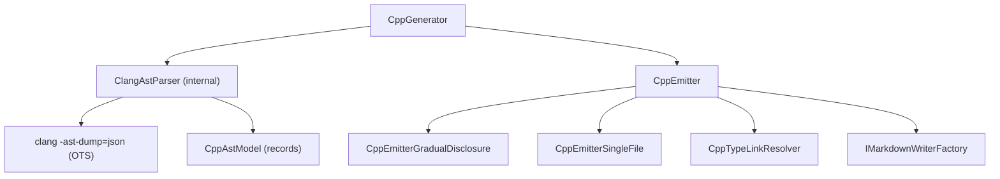

# ApiMarkCpp

<!-- All sections below are MANDATORY. If a section does not apply, write
     "N/A - {justification}" rather than removing it. -->

## Architecture

ApiMarkCpp provides C++ language support. It reads a set of public C++ header
files by invoking clang with `clang -ast-dump=json`, parsing the resulting JSON
AST, applying a file-provenance filter to identify declarations that belong to the
documented public API, and producing the Markdown output defined by the Core
interfaces. The system contains the following units:

- **CppGenerator** — accepts `CppGeneratorOptions` specifying public include
  roots and parse environment, invokes `ClangAstParser` to obtain a fully resolved
  C++ AST as structured records, filters declarations to those physically defined in
  the public header files, and writes the complete gradual-disclosure Markdown tree
  through IMarkdownWriterFactory.
- **CppAstModel** — group of immutable record types (`CppNamespaceDecl`,
  `CppClass`, `CppFunction`, `CppField`, `CppEnum`, `CppTypeAlias`, etc.)
  that represent the parsed C++ AST; constructed exclusively by `ClangAstParser`.
- **ClangAstParser** — internal parser that invokes `clang -ast-dump=json`,
  deserializes the resulting JSON, and returns a `CppCompilationResult`.
- **CppEmitter** — `IApiEmitter` implementation that dispatches to the appropriate
  format-specific emitter and provides shared helper methods used by both emitters.
- **CppEmitterGradualDisclosure** — writes one file per namespace, type, and
  member, creating the navigable gradual-disclosure Markdown tree.
- **CppEmitterSingleFile** — writes all documentation into a single `api.md`
  file using heading levels offset by `EmitConfig.HeadingDepth`.
- **CppTypeLinkResolver** — resolves C++ type strings to Markdown link text for
  table cells in the generated output; tracks non-std external type references.

CppGenerator depends on ClangAstParser and the ApiMarkCore interfaces.
ClangAstParser invokes clang as an external process and parses its JSON output.

## External Interfaces

**IApiGenerator / IApiEmitter (provided)**: CppGenerator implements IApiGenerator from
ApiMarkCore; parsing is separated from emit via the two-stage pipeline.

- *Type*: In-process .NET public API.
- *Role*: Provider — ApiMarkTool constructs CppGenerator and calls the two-stage
  pipeline through the IApiGenerator / IApiEmitter interfaces.
- *Contract*: `CppGenerator(CppGeneratorOptions options)` constructs a
  configured generator; `IApiGenerator.Parse(IContext context)` invokes clang,
  filters declarations, and returns a `CppEmitter` (implements `IApiEmitter`);
  `IApiEmitter.Emit(IMarkdownWriterFactory factory, EmitConfig config, IContext context)`
  writes the full Markdown tree using the supplied factory and the format selected
  by `config`.
- *Constraints*: CppGeneratorOptions must be fully populated before calling
  Parse; all paths in PublicIncludeRoots must exist on disk.

**clang (consumed)**: CppGenerator uses clang via `ClangAstParser` to parse C++ headers.

- *Type*: External process (system-installed or PATH-located executable).
- *Role*: Consumer — `ClangAstParser` invokes `clang -ast-dump=json` with the
  configured include paths, system include paths, preprocessor defines, and
  compiler flags, then parses the JSON output into structured C++ AST records.
- *Contract*: `clang -Xclang -ast-dump=json -fparse-all-comments -fsyntax-only
  -x c++ -std={standard} -I {roots} -isystem {sysroots} -D {defines} {headers}`.
  The clang executable is located using this priority order:
  (1) `CppGeneratorOptions.ClangPath` when set;
  (2) the `APIMARK_CLANG_PATH` environment variable when set;
  (3) `clang` on PATH; (4) `xcrun clang` on macOS; (5) vswhere / default LLVM path on Windows.
- *Constraints*: clang must be installed and accessible; a clear
  `InvalidOperationException` is thrown when clang cannot be found.

**MSBuild (consumed via ApiMarkTask)**: The `.targets` file sets the following
MSBuild properties used to configure generation for C++ projects:

- `$(ApiMarkLibraryName)` — library name used as the top-level heading in
  `api.md`; defaults to `$(MSBuildProjectName)` via the `.targets` file.
- `$(ApiMarkLibraryDescription)` — optional description emitted as an
  introductory paragraph in `api.md`; omitted when empty or not set.
- `$(ApiMarkDefines)` — semicolon-separated list of preprocessor symbol
  definitions passed to the Clang parser; semicolons are converted to commas
  when forwarding to the `--defines` argument.
- `$(ApiMarkCppStandard)` — C++ language standard passed to Clang (e.g.
  `c++17`, `c++20`); defaults to `c++17` via the `.targets` file.

## Dependencies

- **clang**: used to parse C++ header files via `clang -ast-dump=json` — requires
  clang to be installed on the host machine. No NuGet package dependency.

## Risk Control Measures

N/A - not a safety-classified software item.

## Data Flow

1. The caller (ApiMarkTool) constructs `CppGeneratorOptions` with
   PublicIncludeRoots, ApiHeaderPatterns, SystemIncludePaths,
   Defines, CppStandard, AdditionalCompilerArguments,
   Visibility, IncludeDeprecated, and LibraryName, then calls
   `CppGenerator.Parse(context)` to obtain a `CppEmitter`. The caller then
   passes an IMarkdownWriterFactory and an EmitConfig to
   `CppEmitter.Emit(factory, config, context)`.
2. CppGenerator enumerates all header files under each PublicIncludeRoot.
   When ApiHeaderPatterns is non-empty, patterns are applied with gitignore-style
   last-match-wins semantics to produce the candidate file set; when empty, all
   recognized header files under every root are included automatically. All
   candidate headers are concatenated into one temporary combined header and parsed
   as a single translation unit.
3. CppGenerator calls `ClangAstParser.Parse` with all candidate headers and the
   configured options. `ClangAstParser` invokes `clang -ast-dump=json` and parses
   the resulting JSON into `CppCompilationResult` containing `CppNamespaceDecl`
   records. The parser skips AST nodes whose source file is not under a public
   include root, avoiding processing of system and third-party headers.
4. `ClangAstParser` returns a `CppCompilationResult` containing all declarations
   physically located in the public headers, already filtered by ownership.
5. `ClangAstParser` rejects declarations whose source file is not in the
   pre-selected header set (built by `CollectHeaderFiles()` via `GlobFileCollector`).
   Only declarations from selected headers are documented; system and third-party
   declarations are used for type resolution only.
6. For each owned declaration, CppGenerator derives the canonical #include path
   as the source file path relative to its matching PublicIncludeRoot, expressed
   with forward slashes.
7. CppGenerator calls `factory.CreateMarkdown("", "api")` and writes the
   library-level entrypoint listing all namespaces with the count of documented
   types in each.
8. For each namespace containing owned declarations, CppGenerator calls
   `factory.CreateMarkdown(qualifiedNamespace, qualifiedNamespace)` and writes
   a namespace summary listing types and free functions grouped by header.
9. For each owned type, CppGenerator writes the type page with the #include
   path, then emits a dedicated detail page for every visible member. Each
   visible member receives its own page, except where case-insensitive filename
   collisions on a single type require combining the colliding members onto one
   shared page.

## Design Constraints

- Platform: targets net8.0, net9.0, net10.0 as a class library. No NuGet runtime
  packages are required; clang is a system dependency that must be installed
  separately on the host machine.
- Parse environment: the host machine must have clang installed (LLVM, VS-bundled,
  or Xcode on macOS). System include paths can be passed via SystemIncludePaths so
  that system headers resolve without requiring a full toolchain on PATH.
- No compilation required: ApiMarkCpp reads source headers without building the
  C++ project; no object files, link steps, or CMake configuration step is needed.
- Strict ownership model: only declarations whose source file is physically
  located under a configured PublicIncludeRoot are documented. Declarations
  re-exported from system or third-party headers are intentionally excluded
  from the documented surface; the clang JSON walker skips non-owned subtrees.
- v1 scope: primary class and function templates are documented; partial
  specializations, explicit instantiations, and C++ Concepts are out of scope.
  Preprocessor macros are excluded from the documented surface. Doc comments
  are parsed from the clang JSON AST via `-fparse-all-comments`.
