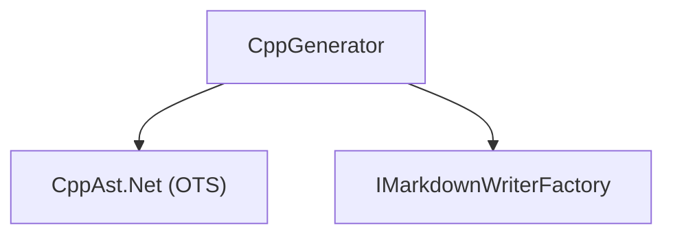

# ApiMarkCpp

<!-- All sections below are MANDATORY. If a section does not apply, write
     "N/A - {justification}" rather than removing it. -->

## Architecture

ApiMarkCpp provides C++ language support. It reads a set of public C++ header
files via CppAst.Net (a libclang wrapper), applies a file-provenance filter to
identify declarations that belong to the documented public API, and produces the
Markdown output defined by the Core interfaces. The system contains one unit:

- **CppGenerator** — accepts `CppGeneratorOptions` specifying public include
  roots and parse environment, invokes CppAst.Net to obtain a fully resolved
  C++ AST, filters declarations to those physically defined in the public header
  files, and writes the complete gradual-disclosure Markdown tree through
  IMarkdownWriterFactory.

CppGenerator depends on CppAst.Net and the ApiMarkCore interfaces.

## External Interfaces

**IApiGenerator (provided)**: CppGenerator implements IApiGenerator from
ApiMarkCore.

- *Type*: In-process .NET public API.
- *Role*: Provider — ApiMarkTool constructs CppGenerator and calls Generate
  through the IApiGenerator interface.
- *Contract*: `CppGenerator(CppGeneratorOptions options)` constructs a
  configured generator; `Generate(IMarkdownWriterFactory factory)` writes the
  full Markdown tree using the supplied factory.
- *Constraints*: CppGeneratorOptions must be fully populated before calling
  Generate; all paths in PublicIncludeRoots must exist on disk.

**CppAst.Net (consumed)**: CppGenerator uses CppAst.Net to parse C++ headers
via libclang.

- *Type*: In-process .NET public API (NuGet package).
- *Role*: Consumer — CppGenerator passes public include roots, system include
  paths, preprocessor defines, and compiler flags to CppAst.Net and receives a
  resolved `CppCompilation` AST in return.
- *Contract*: `CppParser.ParseFiles(files, options)` or equivalent entry point;
  `ICppDeclaration.Span.Start.File` for declaration provenance.
- *Constraints*: System header files (e.g. `<vector>`, `<windows.h>`) must be
  resolvable via the configured SystemIncludePaths; see CppAst.Net Integration
  Design for details.

**MSBuild (consumed via ApiMarkTask)**: The `.targets` file sets the following
MSBuild properties used to configure generation for C++ projects:

- `$(ApiMarkLibraryName)` — library name used as the top-level heading in
  `api.md`; defaults to `$(MSBuildProjectName)` via the `.targets` file.
- `$(ApiMarkLibraryDescription)` — optional description emitted as an
  introductory paragraph in `api.md`; omitted when empty or not set.
- `$(ApiMarkDefines)` — semicolon-separated list of preprocessor symbol
  definitions passed to the Clang parser; semicolons are converted to commas
  when forwarding to the `--defines` argument.
- `$(ApiMarkCppStandard)` — C++ language standard passed to Clang (e.g.
  `c++17`, `c++20`); defaults to `c++17` via the `.targets` file.

## Dependencies

- **CppAst.Net**: used to parse C++ header files via libclang without requiring
  a full C++ build — see CppAst.Net Integration Design.

## Risk Control Measures

N/A — not a safety-classified software item.

## Data Flow

1. The caller (ApiMarkTool) constructs `CppGeneratorOptions` with
   PublicIncludeRoots, IncludePatterns, ExcludePatterns, SystemIncludePaths,
   AdditionalIncludePaths, Defines, CppStandard, AdditionalCompilerArguments,
   Visibility, IncludeDeprecated, and LibraryName, then passes an
   IMarkdownWriterFactory to Generate.
2. CppGenerator enumerates all header files under each PublicIncludeRoot,
   applying IncludePatterns and ExcludePatterns, to produce the candidate file
   set. Each matched header is parsed as an independent translation unit so that
   headers are self-contained.
3. CppGenerator calls CppAst.Net with Clang arguments built from
   PublicIncludeRoots (as -I flags), SystemIncludePaths (as -isystem or -I
   flags), AdditionalIncludePaths (as -I flags), Defines, CppStandard, and
   AdditionalCompilerArguments.
4. CppAst.Net returns a `CppCompilation` containing all declarations resolved
   during parsing, including those from system and third-party headers.
5. CppGenerator applies the IsOwnedDeclaration filter to each declaration:
   only declarations whose source file normalizes to a path under a
   PublicIncludeRoot, matches IncludePatterns, and does not match
   ExcludePatterns are documented. System and third-party declarations are
   used for type resolution only.
6. For each owned declaration, CppGenerator derives the canonical #include path
   as the source file path relative to its matching PublicIncludeRoot, expressed
   with forward slashes.
7. CppGenerator calls `factory.CreateMarkdown("", "api")` and writes the
   library-level entrypoint listing all namespaces.
8. For each namespace containing owned declarations, CppGenerator calls
   `factory.CreateMarkdown(qualifiedNamespace, qualifiedNamespace)` and writes
   a namespace summary listing types and free functions grouped by header.
9. For each owned type, CppGenerator writes the type page with the #include
   path, then emits a dedicated detail page for every visible member. All
   members always receive their own page, making navigation fully deterministic.

## Design Constraints

- Platform: targets net8.0, net9.0, net10.0 as a class library. CppAst.Net
  requires .NET 6 or later and does not support netstandard2.0; ApiMarkCpp
  therefore cannot be referenced from ApiMark.MSBuild directly and must be
  invoked out-of-process via ApiMark.Tool (which already targets net8.0+).
- Parse environment: the host machine must have a C++ toolchain installed and
  the SystemIncludePaths configured so that system headers resolve. CppAst.Net
  ships with libclang but not with platform SDK or STL headers.
- No compilation required: ApiMarkCpp reads source headers without building the
  C++ project; no object files, link steps, or CMake configuration step is
  needed.
- Strict ownership model: only declarations whose source file is physically
  located under a configured PublicIncludeRoot are documented. Declarations
  re-exported from system or third-party headers are intentionally excluded
  from the documented surface.
- v1 scope: primary class and function templates are documented; partial
  specializations, explicit instantiations, and C++ Concepts are out of scope.
  Preprocessor macros are excluded from the documented surface. Doc comments
  are included if CppAst.Net exposes them; otherwise, signatures-only output
  is produced.
