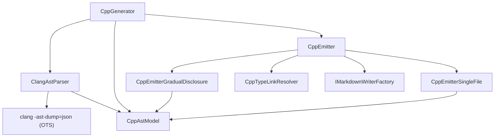

# ApiMarkCpp

<!-- All sections below are MANDATORY. If a section does not apply, write
     "N/A - {justification}" rather than removing it. -->

## Architecture

ApiMarkCpp provides C++ language support by parsing selected public headers with
clang, converting the JSON AST into immutable C# records, and emitting Markdown
through the ApiMarkCore interfaces. The system contains the following units:

- **CppGenerator** — selects public headers, invokes clang, filters deprecated
  top-level declarations, builds the known-type map, and returns `CppEmitter`.
- **CppAstModel** — immutable AST record types exchanged between parser and
  emitters.
- **ClangAstParser** — invokes clang, walks the JSON AST, and returns
  `CppCompilationResult`.
- **CppEmitter** — format dispatcher and shared-helper hub.
- **CppEmitterGradualDisclosure** — writes namespace, type, member, operator,
  enum, and alias pages.
- **CppEmitterSingleFile** — writes all documentation into one `api.md` file.
- **CppTypeLinkResolver** — resolves intra-library type links and tracks external
  types.

## External Interfaces

### IApiGenerator / IApiEmitter (provided)

- *Type*: in-process .NET interfaces.
- *Role*: provider.
- *Contract*: `CppGenerator.Parse(IContext)` returns a `CppEmitter`, and
  `IApiEmitter.Emit(IMarkdownWriterFactory, EmitConfig, IContext)` writes the
  requested Markdown layout.
- *Constraints*: callers must provide a valid `CppGeneratorOptions`; `Emit` throws
  `ArgumentNullException` when the writer factory is null.

### clang (consumed)

- *Type*: out-of-process OTS CLI tool.
- *Role*: consumer.
- *Contract*: `ClangAstParser` invokes `clang -ast-dump=json -fparse-all-comments
  -fsyntax-only -x c++` plus configured include paths, defines, and additional
  compiler arguments.
- *Constraints*: clang must be discoverable through `ClangPath`,
  `APIMARK_CLANG_PATH`, PATH, `xcrun clang`, or Windows LLVM discovery; parse
  failures surface as `InvalidOperationException`.

### IMarkdownWriterFactory (consumed)

- *Type*: in-process .NET interface from ApiMarkCore.
- *Role*: consumer.
- *Contract*: `CppEmitter` receives a factory instance from the caller and passes
  it to the format-specific emitter (`CppEmitterGradualDisclosure` or
  `CppEmitterSingleFile`) to create `IMarkdownWriter` instances for each output file.
- *Constraints*: must not be null; `CppEmitter.Emit` throws `ArgumentNullException`
  when the factory is null.

### MSBuild (consumed via ApiMarkTask)

- *Type*: build-property interface exposed by the ApiMark MSBuild integration.
- *Role*: consumer.
- *Contract*: the `.targets` file forwards nine C++ properties into
  `CppGeneratorOptions`:
  - `$(ApiMarkLibraryName)` → `LibraryName`
  - `$(ApiMarkLibraryDescription)` → `Description`
  - `$(ApiMarkIncludePaths)` → `PublicIncludeRoots` (selects clang `-I` paths)
  - `$(ApiMarkApiHeaders)` → `ApiHeaderPatterns` (gitignore-style header-selection
    patterns)
  - `$(ApiMarkDefines)` → `Defines`
  - `$(ApiMarkCppStandard)` → `CppStandard`
  - `$(ApiMarkClangPath)` → `ClangPath` (explicit clang executable override)
  - `$(ApiMarkVisibility)` → `Visibility` (access-specifier filter)
  - `$(ApiMarkIncludeObsolete)` → `IncludeDeprecated` (deprecated-API inclusion flag)
- *Constraints*: missing or invalid option values surface through constructor
  validation (`ArgumentException`) or parse-time root validation
  (`DirectoryNotFoundException`).

## Dependencies

- **clang** — external AST parser used through `ClangAstParser`.
- **ApiMarkCore** — provides `IApiGenerator`, `IApiEmitter`, `EmitConfig`,
  `IContext`, `IMarkdownWriterFactory`, and `GlobFileCollector`.
- **CppAstModel** — immutable record types that carry parsed declarations from
  `ClangAstParser` through `CppGenerator` to `CppEmitter`.

## Risk Control Measures

N/A - not a safety-classified software item.

## Data Flow

1. The caller builds `CppGeneratorOptions` and calls `CppGenerator.Parse(context)`.
   `CppGenerator` resolves `ApiHeaderPatterns` using `WorkingDirectory` or the
   process CWD, enumerates the selected headers, and invokes `ClangAstParser`.
2. `ClangAstParser` invokes clang on a temporary combined header, walks the JSON
   AST, and returns `CppCompilationResult` containing only declarations whose
   source files are both selected headers and under configured public include
   roots.
3. `CppGenerator` logs system-header diagnostics, rejects public-header parse
   failures, applies `IncludeDeprecated` while collecting namespaces, and builds a
   known-type map covering namespaces, nested classes, and type aliases.
4. `CppEmitter.Emit` routes by `OutputFormat`: `GradualDisclosure` uses
   `CppEmitterGradualDisclosure`, which produces one `api.md` index and separate
   per-namespace, per-type, per-member, per-operator, per-enum, and per-alias pages.
   `SingleFile` uses `CppEmitterSingleFile`, which writes the entire API reference
   into a single `api.md` file with library-name and namespace headings followed by
   type and member sections.
5. During gradual-disclosure emission, regular members receive per-member pages;
   case-insensitive collisions are combined onto a single lowercase page;
   operator overloads are detected by name and grouped onto shared class-level or
   namespace-level `operators.md` pages.
6. Type pages render the class signature line with `final` and direct base-class
   names, then write member tables, nested-class tables, and alias tables.
7. Table-cell type strings are resolved through `CppTypeLinkResolver`. Exact
   qualified matches and unambiguous short-name matches become Markdown links;
   unknown non-`std` namespaced types are accumulated and emitted in an
   `External Types` section at the bottom of the affected page.

## Design Constraints

- Platform: class library targeting modern .NET runtimes; clang is an external
  host dependency.
- Header ownership: only declarations physically defined in selected public
  headers are documented.
- Validation: constructor misuse raises `ArgumentNullException` or
  `ArgumentException`; missing default include roots raise
  `DirectoryNotFoundException`; clang discovery or AST failures raise
  `InvalidOperationException`.
- Output scope: operator overloads are grouped, macros are out of scope, and
  primary template declarations are documented while partial specializations and
  concepts remain outside v1 scope.
