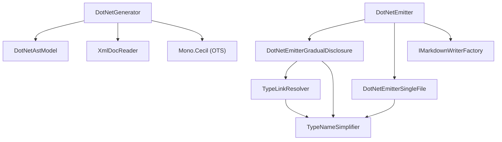

# ApiMarkDotNet

<!-- All sections below are MANDATORY. If a section does not apply, write
     "N/A - {justification}" rather than removing it. -->

## Architecture

ApiMarkDotNet provides C#/.NET language support. It reads a compiled .NET assembly
and its associated XML documentation file, then produces the Markdown output
defined by the Core interfaces. The system contains eleven units:

- **DotNetGenerator** — reads the assembly via Mono.Cecil, processes XML doc
  comments, applies visibility filtering, builds an inheritance chain map from
  assembly metadata, and returns a DotNetEmitter ready for emission.
- **DotNetAstModel** — immutable data class holding all parsed assembly data
  (namespaces, types, XML docs, resolver, options) produced by DotNetGenerator.Parse.
- **DotNetEmitter** — IApiEmitter dispatcher; reads EmitConfig.Format and forwards
  the call to DotNetEmitterGradualDisclosure or DotNetEmitterSingleFile. Also provides
  shared static helper methods used by both sub-emitters.
- **DotNetEmitterGradualDisclosure** — writes the multi-file gradual-disclosure tree
  (one file per namespace, type, and member).
- **DotNetEmitterSingleFile** — writes all documentation into a single api.md file.
- **TypeLinkResolver** — resolves Mono.Cecil TypeReference instances to Markdown link
  text for use in table cells.
- **TypeNameSimplifier** — applies a deterministic set of simplification rules to
  Mono.Cecil type references to produce idiomatic C# type names in output.
- **XmlDocReader** — reads and indexes a .NET XML documentation file for fast
  member-level lookups; resolves `<inheritdoc />` references using the inheritance
  chain map supplied by DotNetGenerator.
- **ApiVisibility** — enum controlling which members are included in the output
  (`Public`, `PublicAndProtected`, `All`).
- **DotNetGeneratorOptions** — configuration value object passed to the
  DotNetGenerator constructor.
- **ExternalTypeInfo** — internal record representing a non-standard external type
  reference collected during table cell generation.

## External Interfaces

**IApiGenerator / IApiEmitter (provided)**: DotNetGenerator implements IApiGenerator from
ApiMarkCore; parsing is separated from emit via the two-stage pipeline.

- *Type*: In-process .NET public API.
- *Role*: Provider — ApiMarkMsbuild and ApiMarkTool construct DotNetGenerator
  and call the two-stage pipeline through the IApiGenerator / IApiEmitter interfaces.
- *Contract*: `DotNetGenerator(DotNetGeneratorOptions options)` constructs a
  configured generator; `IApiGenerator.Parse(IContext context)` reads the assembly
  and returns a `DotNetEmitter` (implements `IApiEmitter`);
  `IApiEmitter.Emit(IMarkdownWriterFactory factory, EmitConfig config, IContext context)`
  writes the full Markdown tree for the configured assembly using the supplied factory
  and the format selected by `config`.
- *Constraints*: DotNetGeneratorOptions must be fully populated before calling
  Parse; AssemblyPath and XmlDocPath must reference files that exist on disk.

**Mono.Cecil (consumed)**: DotNetGenerator uses Mono.Cecil to read assembly metadata.

- *Type*: In-process .NET public API (NuGet package).
- *Role*: Consumer — DotNetGenerator calls Mono.Cecil to enumerate types and members
  without loading the assembly into the current process.
- *Contract*: `AssemblyDefinition.ReadAssembly(path)`, type and member enumeration
  APIs, accessibility modifier inspection.
- *Constraints*: The assembly file must exist on disk and be a valid .NET assembly
  at call time; see Mono.Cecil Integration Design for details.

**IMarkdownWriterFactory (consumed)**: DotNetEmitter receives and uses an IMarkdownWriterFactory
from its caller to create each Markdown output file.

- *Type*: In-process .NET interface from ApiMarkCore.
- *Role*: Consumer — DotNetEmitter calls `CreateMarkdown` for each output file
  path it needs to write.
- *Constraints*: Must not be null at Emit call time.

**IContext (consumed)**: DotNetGenerator accepts an IContext from its caller but does
not currently write any messages through it during generation. The parameter is
accepted for interface compliance and reserved for future diagnostic and progress
messages.

- *Type*: In-process .NET interface from ApiMarkCore.
- *Role*: Consumer (reserved) — DotNetGenerator accepts the context but does not
  currently call any methods on it.
- *Constraints*: Must not be null at Parse and Emit call time.

## Dependencies

- **Mono.Cecil**: used for reading .NET assembly metadata without loading the
  assembly into the current process — see Mono.Cecil Integration Design.

## Risk Control Measures

N/A - not a safety-classified software item.

## Data Flow

1. The caller (ApiMarkMsbuild or ApiMarkTool) constructs DotNetGeneratorOptions
   with AssemblyPath, XmlDocPath, Visibility, and IncludeObsolete, then calls
   `DotNetGenerator.Parse(context)` to obtain a `DotNetEmitter`. The caller
   then passes an IMarkdownWriterFactory and an EmitConfig to
   `DotNetEmitter.Emit(factory, config, context)`.
2. DotNetGenerator calls `AssemblyDefinition.ReadAssembly` (Mono.Cecil) to load
   type and member metadata from disk without loading the assembly into the AppDomain.
3. DotNetGenerator parses the XML documentation file and indexes entries by member
   identifier string.
4. DotNetEmitter selects the active emitter sub-component (DotNetEmitterGradualDisclosure
   or DotNetEmitterSingleFile) based on EmitConfig.Format. For gradual-disclosure output,
   DotNetEmitterGradualDisclosure calls `factory.CreateMarkdown("", "api")` and writes the
   assembly-level entrypoint file listing all namespaces.
5. For each namespace, DotNetEmitterGradualDisclosure calls `factory.CreateMarkdown(namespaceFolderPath,
   namespaceName)` and writes a namespace summary listing all visible types.
6. For each visible type, DotNetEmitterGradualDisclosure writes every member to its own dedicated
   file via `factory.CreateMarkdown(namespaceFolderPath, typeName)` and links all members
   from the type page. Each member receives its own page, except where case-insensitive
   filename collisions on a single type require combining colliding members onto one
   shared page.
7. TypeNameSimplifier is called for each type reference encountered during output
   generation, producing simplified C# type names relative to the current namespace.

## Design Constraints

- Platform: targets .NET 8 as a class library; no platform-specific code.
- Dependency on ApiMarkCore: depends on IApiGenerator, IApiEmitter, EmitConfig,
  IMarkdownWriterFactory, and IMarkdownWriter from ApiMarkCore; must not duplicate
  their logic.
- No AppDomain loading: assemblies must be read via Mono.Cecil only — the standard
  System.Reflection API must not be used for assembly reflection.
- Visibility filter: the Visibility option (Public, PublicAndProtected, All) must be
  applied before any member is written to output.
