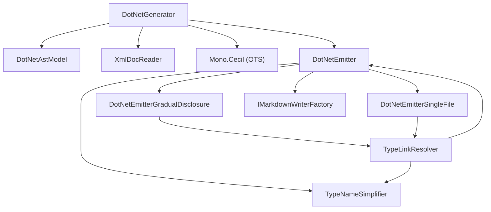

# ApiMarkDotNet

<!-- All sections below are MANDATORY. If a section does not apply, write
     "N/A - {justification}" rather than removing it. -->

## Architecture

ApiMarkDotNet provides C#/.NET language support. It reads a compiled .NET assembly
and its associated XML documentation file, then produces the Markdown output
defined by the Core interfaces. The system contains eight units:

- **DotNetGenerator** — reads the assembly via Mono.Cecil, processes XML doc
  comments, applies visibility filtering, builds an inheritance chain map from
  assembly metadata, and returns a DotNetEmitter ready for emission. The
  inheritance chain map is also used to render direct base-type and interface
  inheritance in type signatures (not only for `<inheritdoc>` resolution).
  During `Parse`, DotNetGenerator recognizes `internal static class NamespaceDoc`
  carrier classes, excludes them from type listings, and promotes their XML
  `
`, `<remarks>`, and `<example>` content to the namespace description
  dictionary.
- **DotNetAstModel** — immutable data class holding all parsed assembly data
  (namespaces, types, XML docs, resolver, options) produced by DotNetGenerator.Parse.
- **DotNetEmitter** — IApiEmitter dispatcher; reads EmitConfig.Format and forwards
  the call to DotNetEmitterGradualDisclosure or DotNetEmitterSingleFile. Also provides
  shared static helper methods used by both sub-emitters.
- **DotNetEmitterGradualDisclosure** — writes the multi-file gradual-disclosure tree
  (one file per namespace and type, and one file per member except where the model
  combines case-insensitive filename collisions onto a shared page). Types declaring
  operator overloads receive a dedicated `operators.md` page grouping all operators
  with C# method-signature headings and summaries. Nested types appear in a
  "Nested Types" table on the containing type page and receive dedicated pages under
  the containing type's folder.
- **DotNetEmitterSingleFile** — writes all documentation into a single api.md file.
- **TypeLinkResolver** — resolves Mono.Cecil TypeReference instances to Markdown link
  text for use in table cells.
- **TypeNameSimplifier** — applies a deterministic set of simplification rules to
  Mono.Cecil type references to produce idiomatic C# type names in output.
- **XmlDocReader** — reads and indexes a .NET XML documentation file for fast
  member-level lookups; resolves `<inheritdoc />` references using the inheritance
  chain map supplied by DotNetGenerator.

Three support types — `ApiVisibility`, `DotNetGeneratorOptions`, and `ExternalTypeInfo` —
are defined alongside their owning units in `DotNetGenerator.cs` and `TypeLinkResolver.cs`
and are not counted as separate units.

## External Interfaces

**IApiGenerator / IApiEmitter (provided)**: DotNetGenerator implements IApiGenerator from
ApiMarkCore; parsing is separated from emit via the two-stage pipeline.

- *Type*: In-process .NET public API.
- *Role*: Provider — ApiMarkMsbuild and ApiMarkTool construct DotNetGenerator
  and call the two-stage pipeline through the IApiGenerator / IApiEmitter interfaces.
- *Contract*: `DotNetGenerator(DotNetGeneratorOptions options)` constructs a
  configured generator; `IApiGenerator.Parse(IContext context)` reads the assembly
  and returns a `DotNetEmitter` (implements `IApiEmitter`);
  `IApiEmitter.Emit(IMarkdownWriterFactory factory, EmitConfig config, IContext context)`
  writes the full Markdown tree for the configured assembly using the supplied factory
  and the format selected by `config`.
- *Constraints*: DotNetGeneratorOptions must be fully populated before calling
  Parse; AssemblyPath and XmlDocPath must both reference files that exist on disk.

**Mono.Cecil (consumed)**: DotNetGenerator uses Mono.Cecil to read assembly metadata.

- *Type*: In-process .NET public API (NuGet package).
- *Role*: Consumer — DotNetGenerator calls Mono.Cecil to enumerate types and members
  without loading the assembly into the current process.
- *Contract*: `AssemblyDefinition.ReadAssembly(path)`, type and member enumeration
  APIs, accessibility modifier inspection.
- *Constraints*: The assembly file must exist on disk and be a valid .NET assembly
  at call time; see Mono.Cecil Integration Design for details.

**IMarkdownWriterFactory (consumed)**: DotNetEmitter receives and uses an IMarkdownWriterFactory
from its caller to create each Markdown output file.

- *Type*: In-process .NET interface from ApiMarkCore.
- *Role*: Consumer — DotNetEmitter calls `CreateMarkdown` for each output file
  path it needs to write.
- *Constraints*: Must not be null at Emit call time.

**IContext (consumed)**: DotNetGenerator accepts an IContext from its caller and
emits progress messages through it during `Parse`.

- *Type*: In-process .NET interface from ApiMarkCore.
- *Role*: Consumer — `DotNetGenerator.Parse` calls `IContext.WriteLine` to emit
  two progress messages: one before opening the assembly (naming the assembly file)
  and one after type collection (reporting the type count and namespace count).
- *Constraints*: Must not be null at Parse and Emit call time.

## Dependencies

- **Mono.Cecil**: used for reading .NET assembly metadata without loading the
  assembly into the current process — see Mono.Cecil Integration Design.

## Risk Control Measures

N/A - not a safety-classified software item.

## Data Flow

1. The caller (ApiMarkMsbuild or ApiMarkTool) constructs DotNetGeneratorOptions
   with AssemblyPath, XmlDocPath, Visibility, IncludeObsolete, and ExcludePatterns,
   then calls
   `DotNetGenerator.Parse(context)` to obtain a `DotNetEmitter`. The caller
   then passes an IMarkdownWriterFactory and an EmitConfig to
   `DotNetEmitter.Emit(factory, config, context)`.
2. DotNetGenerator calls `AssemblyDefinition.ReadAssembly` (Mono.Cecil) to load
   type and member metadata from disk without loading the assembly into the AppDomain.
3. DotNetGenerator parses the XML documentation file and indexes entries by member
   identifier string. During this phase, `DotNetGenerator.Parse` recognizes
   `internal static class NamespaceDoc` carrier types: they are excluded from the
   visible type listing, and their XML `
`, `<remarks>`, and `<example>`
   content is promoted to the namespace description dictionary keyed by namespace
   name.
4. DotNetEmitter selects the active emitter sub-component (DotNetEmitterGradualDisclosure
   or DotNetEmitterSingleFile) based on EmitConfig.Format. For gradual-disclosure output,
   DotNetEmitterGradualDisclosure calls `factory.CreateMarkdown("", "api")` and writes the
   assembly-level entrypoint file listing all namespaces.
5. For each namespace, DotNetEmitterGradualDisclosure splits the namespace folder path into a
   subfolder and short name, then calls `factory.CreateMarkdown(subFolder, shortName)` and writes
   a namespace summary listing all visible types.
6. For each visible type, DotNetEmitterGradualDisclosure writes member pages using three
   distinct page-generation strategies: (1) individual detail pages per member via
   `factory.CreateMarkdown(namespaceFolderPath, typeName)` — the default for all non-colliding
   members; (2) collision-combined pages for case-insensitive filename collisions on a single
   type, where two or more members whose sanitized names differ only in case are merged onto one
   shared page named after the lower-invariant key; and (3) an operators group page
   (`operators.md`) for types that declare operator overloads, grouping all operators with C#
   method-signature headings and summaries. All members are linked from the type page. Nested
   types appear in a "Nested Types" table on the containing type page and receive dedicated
   pages under the containing type's folder via additional `factory.CreateMarkdown` calls.
7. TypeNameSimplifier is called for each type reference encountered during output
   generation, producing simplified C# type names relative to the current namespace.
8. As TypeLinkResolver resolves each table cell it accumulates non-System external type
   references into a per-file `ISet<ExternalTypeInfo>` supplied by the emitter. After
   all table rows for a page are written, DotNetEmitterGradualDisclosure emits the
   "External Types" section listing all tracked external types in alphabetical order, if
   any were collected. DotNetEmitterSingleFile does not emit External Types sections
   because single-file output is a linear document intended for human consumption (e.g.,
   PDF compilation). A global external-type list stripped of per-member context provides
   little navigational value in that format; external type information is most useful when
   scoped to the individual page on which the type appears.

## Design Constraints

- Platform: targets .NET 8 as a class library; no platform-specific code.
- Dependency on ApiMarkCore: depends on IApiGenerator, IApiEmitter, EmitConfig,
  IMarkdownWriterFactory, and IMarkdownWriter from ApiMarkCore; must not duplicate
  their logic.
- No AppDomain loading: assemblies must be read via Mono.Cecil only — the standard
  System.Reflection API must not be used for assembly reflection.
- Visibility filter: the Visibility option (Public, PublicAndProtected, All) must be
  applied before any member is written to output.
- Exclude-pattern filter: ExcludePatterns wildcard matching is applied in the same
  filtering pass as the visibility filter, so excluded namespaces and types never
  appear in any generated index or page.

## Error Handling

- **Invalid file paths**: `DotNetGenerator.Parse` throws `FileNotFoundException` if
  `AssemblyPath` or `XmlDocPath` do not exist on disk. The exception propagates to the
  caller unchanged.
- **Null arguments**: `DotNetGenerator(DotNetGeneratorOptions)` throws
  `ArgumentNullException` if `options` is null. `DotNetGenerator.Parse(IContext)`
  throws `ArgumentNullException` if `context` is null. `IApiEmitter.Emit(factory, config,
  context)` throws `ArgumentNullException` if any of `factory`, `config`, or `context`
  is null.
- **Malformed XML documentation**: `XmlDocReader` silently ignores malformed or missing
  XML doc elements — unrecognized elements produce empty/null lookups rather than
  exceptions, so generation continues with placeholder text where doc content is absent.
