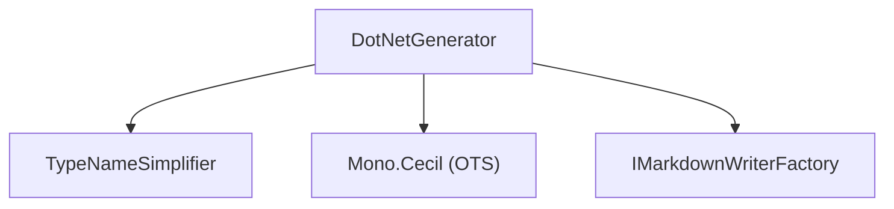

# ApiMarkDotNet

<!-- All sections below are MANDATORY. If a section does not apply, write
     "N/A - {justification}" rather than removing it. -->

## Architecture

ApiMarkDotNet provides C#/.NET language support. It reads a compiled .NET assembly
and its associated XML documentation file, then produces the Markdown output
defined by the Core interfaces. The system contains two units:

- **DotNetGenerator** — reads the assembly via Mono.Cecil, processes XML doc
  comments, applies visibility filtering, type-name simplification, and the
  complexity rule, then writes Markdown through IMarkdownWriterFactory.
- **TypeNameSimplifier** — applies a deterministic set of simplification rules to
  Mono.Cecil type references to produce idiomatic C# type names in output.

DotNetGenerator depends on TypeNameSimplifier, Mono.Cecil, and the ApiMarkCore
interfaces. TypeNameSimplifier has no dependencies of its own beyond Mono.Cecil.

## External Interfaces

**IApiGenerator (provided)**: DotNetGenerator implements IApiGenerator from
ApiMarkCore.

- *Type*: In-process .NET public API.
- *Role*: Provider — ApiMarkMSBuildDotNet and ApiMarkTool construct DotNetGenerator
  and call Generate through the IApiGenerator interface.
- *Contract*: `DotNetGenerator(DotNetGeneratorOptions options)` constructs a
  configured generator; `Generate(IMarkdownWriterFactory factory)` writes the
  full Markdown tree for the configured assembly using the supplied factory.
- *Constraints*: DotNetGeneratorOptions must be fully populated before calling
  Generate; AssemblyPath and XmlDocPath must reference files that exist on disk.

**Mono.Cecil (consumed)**: DotNetGenerator uses Mono.Cecil to read assembly metadata.

- *Type*: In-process .NET public API (NuGet package).
- *Role*: Consumer — DotNetGenerator calls Mono.Cecil to enumerate types and members
  without loading the assembly into the current process.
- *Contract*: `AssemblyDefinition.ReadAssembly(path)`, type and member enumeration
  APIs, accessibility modifier inspection.
- *Constraints*: The assembly file must exist on disk and be a valid .NET assembly
  at call time; see Mono.Cecil Integration Design for details.

## Dependencies

- **Mono.Cecil**: used for reading .NET assembly metadata without loading the
  assembly into the current process — see Mono.Cecil Integration Design.

## Risk Control Measures

N/A — not a safety-classified software item.

## Data Flow

1. The caller (ApiMarkMSBuildDotNet or ApiMarkTool) constructs DotNetGeneratorOptions
   with AssemblyPath, XmlDocPath, Visibility, and IncludeObsolete, then passes an
   IMarkdownWriterFactory to Generate.
2. DotNetGenerator calls `AssemblyDefinition.ReadAssembly` (Mono.Cecil) to load
   type and member metadata from disk without loading the assembly into the AppDomain.
3. DotNetGenerator parses the XML documentation file and indexes entries by member
   identifier string.
4. DotNetGenerator calls `factory.CreateMarkdown("", "api")` and writes the
   assembly-level entrypoint file listing all namespaces.
5. For each namespace, DotNetGenerator calls `factory.CreateMarkdown(namespaceName,
   namespaceName)` and writes a namespace summary listing all visible types.
6. For each visible type, DotNetGenerator applies the complexity rule: members with
   parameters, exception docs, multi-line remarks, examples, or asymmetric get/set
   get their own file via `factory.CreateMarkdown(namespaceName, typeName)`; all
   others are inlined as table rows on the type page.
7. TypeNameSimplifier is called for each type reference encountered during output
   generation, producing simplified C# type names relative to the current namespace.

## Design Constraints

- Platform: targets .NET 8 as a class library; no platform-specific code.
- Dependency on ApiMarkCore: depends on IApiGenerator, IMarkdownWriterFactory, and
  IMarkdownWriter from ApiMarkCore; must not duplicate their logic.
- No AppDomain loading: assemblies must be read via Mono.Cecil only — the standard
  System.Reflection API must not be used for assembly reflection.
- Visibility filter: the Visibility option (Public, PublicAndProtected, All) must be
  applied before any member is written to output.
