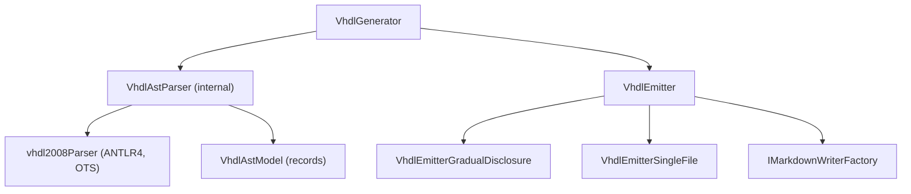

# ApiMarkVhdl

<!-- All sections below are MANDATORY. If a section does not apply, write
     "N/A - {justification}" rather than removing it. -->

## Architecture

ApiMarkVhdl provides VHDL language support. It reads a set of VHDL source
files, parses them using the ANTLR4 vhdl2008 grammar, pre-processes source
lines to extract --! doc comments, and produces the Markdown output defined
by the Core interfaces. The system contains the following units:

- **VhdlGenerator** — accepts `VhdlGeneratorOptions` specifying source file glob
  patterns, invokes `GlobFileCollector` to enumerate VHDL source files, delegates
  parsing to `VhdlAstParser`, and returns a `VhdlEmitter` that writes the complete
  Markdown documentation.
- **VhdlAstModel** — group of immutable record types (`VhdlEntityDecl`,
  `VhdlArchitectureDecl`, `VhdlPackageDecl`, `VhdlTypeDecl`, `VhdlConstantDecl`,
  `VhdlComponentDecl`, `VhdlSubprogramDecl`, `VhdlParamDecl`, `VhdlParamDoc`,
  `VhdlPortDoc`, `VhdlGenericDoc`, `VhdlDocComment`, and the `VhdlSubprogramKind`
  enum) that represent the parsed VHDL AST.
- **VhdlAstParser** — internal parser that pre-processes source lines to
  extract --! doc comments, invokes the ANTLR4 vhdl2008 grammar to parse the
  file, walks the parse tree to collect entity, architecture, and package
  declarations, and returns a `VhdlFileModel`.
- **VhdlEmitter** — `IApiEmitter` implementation that validates the mandatory
  factory argument and dispatches to the appropriate format-specific emitter.
- **VhdlEmitterGradualDisclosure** — writes one file per entity, architecture,
  and package, plus an `api.md` index page listing all entities and packages.
- **VhdlEmitterSingleFile** — writes all documentation into a single `api.md`
  file using heading levels offset by `EmitConfig.HeadingDepth`.

VhdlGenerator depends on VhdlAstParser and the ApiMarkCore interfaces.
VhdlAstParser invokes the ANTLR4 vhdl2008 parser to produce a concrete
syntax tree, then walks it to produce the VhdlFileModel.

## External Interfaces

**IApiGenerator / IApiEmitter (provided)**: VhdlGenerator implements IApiGenerator
from ApiMarkCore; parsing is separated from emit via the two-stage pipeline.

- *Type*: In-process .NET public API.
- *Role*: Provider — ApiMarkTool constructs VhdlGenerator and calls the two-stage
  pipeline through the IApiGenerator / IApiEmitter interfaces.
- *Contract*: `VhdlGenerator(VhdlGeneratorOptions options)` constructs a
  configured generator; `IApiGenerator.Parse(IContext context)` parses all
  configured VHDL files and returns a `VhdlEmitter` (implements `IApiEmitter`);
  `IApiEmitter.Emit(IMarkdownWriterFactory factory, EmitConfig config, IContext context)`
  writes the full Markdown tree using the supplied factory and the format selected
  by `config`.
- *Constraints*: VhdlGeneratorOptions.LibraryName must be non-empty before calling
  Parse; Sources glob patterns must match at least one `.vhd` or `.vhdl` file at
  parse time — if no files are matched, an error is emitted via `context.WriteError`.

**ANTLR4 vhdl2008 grammar (consumed)**: VhdlAstParser uses the pre-generated
ANTLR4 parser to parse VHDL-2008 source files.

- *Type*: In-process .NET library (Antlr4.Runtime.Standard NuGet package, generated parser classes).
- *Role*: Consumer — `VhdlAstParser` creates an `AntlrInputStream` from the source
  text, runs the `vhdl2008Lexer` and `vhdl2008Parser`, and walks the resulting
  parse tree using a `vhdl2008BaseVisitor<object?>` subclass.
- *Contract*: The parser handles VHDL-2008 syntax as defined by the vhdl2008.g4 grammar.
  Comments and whitespace are discarded via `-> skip` rules; doc comments are
  extracted by pre-processing source lines before parsing.
- *Constraints*: The ANTLR-generated files in `VhdlAst/Antlr/` must not be modified.

## Dependencies

- **Antlr4.Runtime.Standard**: NuGet package providing the ANTLR4 runtime for parsing
  VHDL source files using the pre-generated vhdl2008 grammar.

## Risk Control Measures

N/A - not a safety-classified software item.

## Data Flow

1. The caller (ApiMarkTool) constructs `VhdlGeneratorOptions` with
   LibraryName, Sources (glob patterns), and Description, then calls
   `VhdlGenerator.Parse(context)` to obtain a `VhdlEmitter`. The caller then
   passes an IMarkdownWriterFactory and an EmitConfig to
   `VhdlEmitter.Emit(factory, config, context)`.
2. VhdlGenerator calls `GlobFileCollector.Collect(_options.Sources, vhdlExtensions, cwd)`
   to build the selected-file set. If no files are matched, an error is emitted via
   `context.WriteError` and an empty `VhdlEmitter` is returned.
3. VhdlGenerator calls `VhdlAstParser.Parse(filePath)` for each file.
   `VhdlAstParser` reads the file as text, pre-processes source lines to build
   a line-number-to-comment mapping, creates an ANTLR4 pipeline, parses the
   file using the vhdl2008 grammar, and walks the parse tree to collect
   `VhdlEntityDecl`, `VhdlArchitectureDecl`, and `VhdlPackageDecl` records.
4. `VhdlAstParser` returns a `VhdlFileModel` containing all declarations
   found in the file, with associated doc comments extracted from --! annotations.
5. VhdlGenerator collects all VhdlFileModel results and constructs a
   `VhdlEmitter` wrapping the options and file models.
6. When Emit is called, VhdlEmitter dispatches to `VhdlEmitterGradualDisclosure`
   or `VhdlEmitterSingleFile` based on `config.Format`.
7. For gradual disclosure: `factory.CreateMarkdown("", "api")` creates the index
   page; `factory.CreateMarkdown("", entityName)` creates each entity page (with
   architectures rendered inline); `factory.CreateMarkdown("", packageName)` creates
   each package page.
8. For single-file: `factory.CreateMarkdown("", "api")` is the only file created.

## Design Constraints

- Platform: targets net8.0 as a class library (the project targets net8.0 only).
- Parse environment: ANTLR4 vhdl2008 grammar discards all comments via skip rules;
  doc comment extraction is performed by pre-processing source lines independently
  of the ANTLR parse step.
- The ANTLR-generated files in `VhdlAst/Antlr/` are off-limits for modification.
- VHDL identifiers are case-insensitive; entity and architecture names are preserved
  as-is from the source file for file naming.
- v1 scope: entities, architectures, and packages are documented; package bodies,
  configurations, and signal/component declarations inside architectures are
  out of scope.
